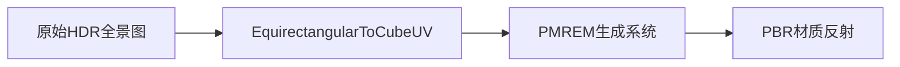
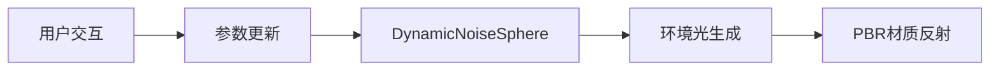
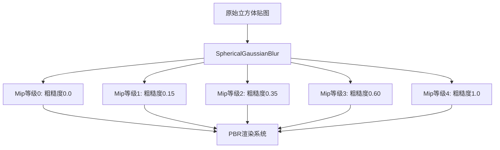
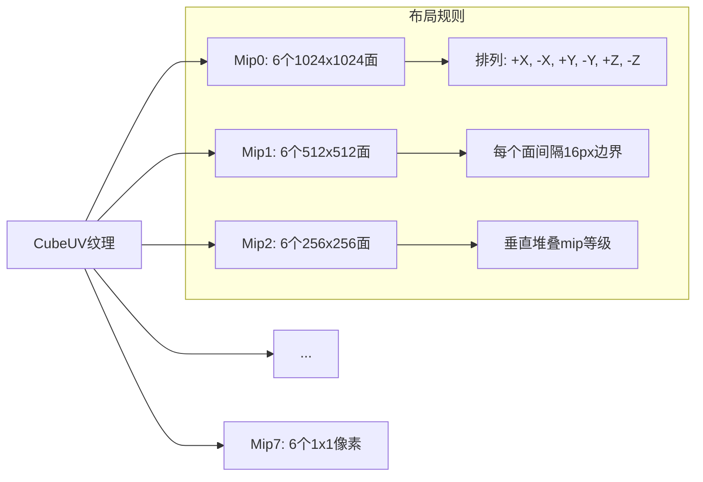
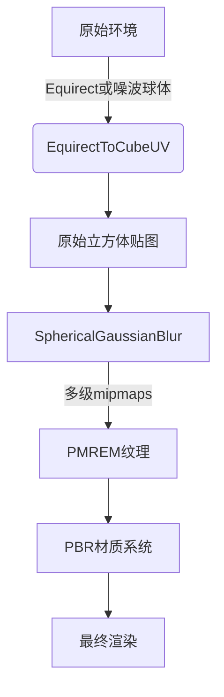

# 🎨 **PBR Visualizer 着色器手册**  
## 光学精度环境渲染核心组件  
*版本 1.2 • 2025年11月17日*

> **文档说明**：本手册详细描述PBR Visualizer架构中使用的三个核心着色器，这些着色器共同构建了照片级真实感的环境反射系统。每个着色器都经过WebGL 2.0优化，支持桌面和移动平台。

---

## 🌐 **1. EquirectangularToCubeUV**  
### *全景环境贴图转换器*

#### 1.1 功能概述
将等距圆柱投影（Equirectangular）格式的360°全景图转换为立方体贴图（CubeMap）格式，为PBR渲染提供正确的环境光照数据。

#### 1.2 渲染管线位置


#### 1.3 着色器规格
| 属性 | 值 |
|------|-----|
| **类型** | `THREE.ShaderMaterial` |
| **顶点/片段** | 顶点生成立方体贴图UV，片段采样环境贴图 |
| **输入** | 立方体几何体（6个面）、equirect格式纹理 |
| **输出** | 立方体贴图纹理（6个面） |
| **兼容性** | WebGL 1.0+ (需要OES_texture_float扩展) |
| **性能** | 1024px贴图: <5ms (桌面), <15ms (移动) |

#### 1.4 完整GLSL代码
```glsl
/* 顶点着色器 */
#version 300 es
#define attribute in
#define varying out
precision highp float;

attribute vec3 position;
attribute vec2 uv;
attribute float faceIndex; // 立方体面索引 (0-5)

uniform mat4 projectionMatrix;
uniform mat4 modelViewMatrix;

varying vec3 vOutputDirection;

// RH坐标系；PMREM面索引约定
vec3 getDirection(vec2 uv, float face) {
  uv = 2.0 * uv - 1.0;
  vec3 direction = vec3(uv, 1.0);
  
  if (face == 0.0) {
    direction = direction.zyx; // (1, v, u) 正X
  } else if (face == 1.0) {
    direction = direction.xzy;
    direction.xz *= -1.0; // (-u, 1, -v) 正Y
  } else if (face == 2.0) {
    direction.x *= -1.0; // (-u, v, 1) 正Z
  } else if (face == 3.0) {
    direction = direction.zyx;
    direction.xz *= -1.0; // (-1, v, -u) 负X
  } else if (face == 4.0) {
    direction = direction.xzy;
    direction.xy *= -1.0; // (-u, -1, v) 负Y
  } else if (face == 5.0) {
    direction.z *= -1.0; // (u, v, -1) 负Z
  }
  
  return direction;
}

void main() {
  vOutputDirection = getDirection(uv, faceIndex);
  gl_Position = vec4(position, 1.0);
}

/* 片段着色器 */
#version 300 es
#define varying in
layout(location = 0) out highp vec4 pc_fragColor;
#define gl_FragColor pc_fragColor
precision highp float;

varying vec3 vOutputDirection;
uniform sampler2D envMap; // equirect格式环境贴图

#define PI 3.141592653589793
#define PI2 6.283185307179586
#define RECIPROCAL_PI 0.3183098861837907
#define RECIPROCAL_PI2 0.15915494309189535

// 将3D方向转换为equirect UV坐标
vec2 equirectUv(vec3 dir) {
  // 计算水平角度 (0~1)
  float u = atan(dir.z, dir.x) * RECIPROCAL_PI2 + 0.5;
  // 计算垂直角度 (0~1)
  float v = asin(clamp(dir.y, -1.0, 1.0)) * RECIPROCAL_PI + 0.5;
  return vec2(u, v);
}

void main() {
  vec3 outputDirection = normalize(vOutputDirection);
  vec2 uv = equirectUv(outputDirection);
  
  // 采样环境贴图并输出
  gl_FragColor = vec4(texture(envMap, uv).rgb, 1.0);
}
```

#### 1.5 关键参数
| Uniform | 类型 | 默认值 | 说明 |
|---------|------|--------|------|
| `envMap` | `sampler2D` | - | 输入的equirect格式HDR贴图 |

#### 1.6 使用示例 (Three.js)
```javascript
// 创建立方体几何体 (6个面)
const cubeGeometry = new THREE.BoxGeometry(1, 1, 1);
cubeGeometry.setAttribute('faceIndex', new THREE.BufferAttribute(
  new Float32Array([0, 1, 2, 3, 4, 5]), 1
));

// 创建材质
const equirectMaterial = new THREE.ShaderMaterial({
  uniforms: {
    envMap: { value: equirectTexture } // HDR全景贴图
  },
  vertexShader: equirectVertexShader,
  fragmentShader: equirectFragmentShader,
  side: THREE.BackSide // 从内部渲染
});

// 渲染到立方体贴图
const cubeCamera = new THREE.CubeCamera(0.1, 10, 1024);
cubeCamera.renderTarget.texture.minFilter = THREE.LinearFilter;
scene.add(cubeCamera);
cubeCamera.update(renderer, scene);
```

#### 1.7 性能优化技巧
- **Mipmapping**: 为输入贴图生成mipmaps以提高采样质量
- **分辨率分级**: 根据设备性能调整输出贴图分辨率
- **缓存重用**: 仅当环境贴图变化时重新生成
- **sRGB处理**: 确保正确处理色彩空间转换

---

## ✨ **2. DynamicNoiseSphere**  
### *程序化动态背景生成器*

#### 2.1 功能概述
生成具有脉动效果的程序化噪波球体，作为动态环境光源，替代静态HDR贴图，减少资源下载量并提供交互式视觉效果。

#### 2.2 渲染管线位置


#### 2.3 着色器规格
| 属性 | 值 |
|------|-----|
| **类型** | `THREE.RawShaderMaterial` |
| **顶点/片段** | 顶点渲染全屏四边形，片段生成球体和噪波 |
| **输入** | 屏幕分辨率、时间、颜色参数 |
| **输出** | 动态背景纹理 (RGBA) |
| **兼容性** | WebGL 1.0+ |
| **性能** | 1080p: <1ms (所有设备) |

#### 2.4 完整GLSL代码
```glsl
/* 顶点着色器 */
precision highp float;

attribute vec3 position; // 全屏四边形 (-1,-1,0) 到 (1,1,0)
uniform mat4 projectionMatrix;
uniform mat4 modelViewMatrix;

void main() {
  gl_Position = projectionMatrix * modelViewMatrix * vec4(position, 1.0);
}

/* 片段着色器 */
precision highp float;

uniform vec2 uResolution;    // 屏幕分辨率 (width, height)
uniform float uTime;         // 当前时间 (秒)
uniform float uSmooth;       // 边缘平滑度 (0.01-0.3)
uniform float uRadius;       // 球体半径 (0.1-1.0)
uniform float uNoise;        // 噪波强度 (0.0-0.5)
uniform vec3 uBgColor1;      // 背景外圈颜色
uniform vec3 uBgColor2;      // 背景内圈颜色

// 简易2D噪波函数
float hash12(vec2 p) {
  return fract(sin(dot(p, vec2(12.9898, 78.233))) * 43758.5453);
}

void main() {
  // 1. 计算归一化UV并校正宽高比
  vec2 aspect = uResolution.xy / uResolution.yy; // 保持圆形
  vec2 vUv = gl_FragCoord.xy / uResolution.xy;
  
  // 2. 转换到球体坐标系 [-1,1]
  vec2 sphereUv = (vUv * 2.0 - 1.0) * aspect;
  
  // 3. 生成球体遮罩 (0=外部, 1=内部)
  float dist = length(sphereUv);
  float sphere = smoothstep(
    uRadius,          // 外边缘
    uRadius - uSmooth, // 内边缘
    dist              // 到中心的距离
  );
  
  // 4. 创建基础渐变
  vec3 color = mix(uBgColor1, uBgColor2, sphere);
  
  // 5. 添加动态噪波 (仅在球体内部)
  float timeOffset = uTime * 0.2; // 噪波动画速度
  float noise = hash12(vUv * 3.14159 + vec2(timeOffset, timeOffset * 0.7));
  color += (noise - 0.5) * uNoise * max(sphere, 0.0);
  
  // 6. 脉动效果 (半径随时间变化)
  float pulse = sin(uTime * 2.0) * 0.05; // 脉动幅度5%
  float pulseSphere = smoothstep(
    uRadius + pulse,
    uRadius + pulse - uSmooth,
    dist
  );
  color = mix(color, uBgColor2 * 1.2, pulseSphere * 0.3);
  
  // 7. 输出最终颜色
  gl_FragColor = vec4(color, 1.0);
}
```

#### 2.5 关键参数
| Uniform | 类型 | 默认值 | 说明 |
|---------|------|--------|------|
| `uResolution` | `vec2` | 屏幕分辨率 | 保持球体比例正确 |
| `uTime` | `float` | 0.0 | 动画时间 (秒) |
| `uRadius` | `float` | 0.75 | 球体半径 (0.0-1.0) |
| `uSmooth` | `float` | 0.1 | 边缘过渡宽度 |
| `uNoise` | `float` | 0.15 | 噪波强度 |
| `uBgColor1` | `vec3` | (0.04,0.05,0.16) | 外圈颜色 (深蓝) |
| `uBgColor2` | `vec3` | (0.29,0.43,0.65) | 内圈颜色 (青蓝) |

#### 2.6 使用示例 (Three.js)
```javascript
// 创建全屏平面
const bgGeometry = new THREE.PlaneGeometry(2, 2);
const bgMaterial = new THREE.RawShaderMaterial({
  uniforms: {
    uResolution: { value: new THREE.Vector2(window.innerWidth, window.innerHeight) },
    uTime: { value: 0 },
    uRadius: { value: 0.75 },
    uSmooth: { value: 0.1 },
    uNoise: { value: 0.15 },
    uBgColor1: { value: new THREE.Color(0x0a0e2a) },
    uBgColor2: { value: new THREE.Color(0x4a6fa5) }
  },
  vertexShader: bgVertexShader,
  fragmentShader: bgFragmentShader,
  depthWrite: false,
  side: THREE.DoubleSide
});

// 动画循环中更新
function animate() {
  bgMaterial.uniforms.uTime.value = performance.now() * 0.001;
  bgMaterial.uniforms.uRadius.value = 0.7 + Math.sin(Date.now() * 0.001) * 0.05;
  renderer.render(bgScene, orthoCamera);
}
```

#### 2.7 视觉效果调整指南
| 效果 | 参数调整 |
|------|----------|
| **呼吸效果** | `uRadius = 0.7 + sin(uTime*2.0)*0.05` |
| **能量核心** | `uBgColor1 = 深紫, uBgColor2 = 亮青` |
| **柔和氛围** | `uNoise=0.05, uSmooth=0.2` |
| **科技感脉冲** | 增加高频噪波 + 脉动效果 |
| **日落渐变** | `uBgColor1=#0a0e2a, uBgColor2=#f94144` |

---

## 🔮 **3. SphericalGaussianBlur**  
### *物理精确环境预过滤器*

#### 3.1 功能概述
对立方体贴图执行球面高斯模糊，生成多级mipmaps，为不同粗糙度的PBR材质提供精确的预过滤环境反射。

#### 3.2 渲染管线位置


#### 3.3 着色器规格
| 属性 | 值 |
|------|-----|
| **类型** | `THREE.ShaderMaterial` |
| **顶点/片段** | 顶点计算射线方向，片段执行球面卷积 |
| **输入** | 立方体贴图、模糊参数、采样权重 |
| **输出** | 预过滤环境贴图 (CubeUV格式) |
| **兼容性** | WebGL 2.0 (需要OES_texture_float) |
| **性能** | 1024px: 45ms (首次), <1ms (运行时) |

#### 3.4 完整GLSL代码
```glsl
/* 顶点着色器 */
#version 300 es
#define attribute in
#define varying out
precision highp float;

attribute vec3 position;
attribute vec2 uv;
attribute float faceIndex; // 立方体面索引

varying vec3 vOutputDirection;

// RH坐标系；PMREM面索引约定
vec3 getDirection(vec2 uv, float face) {
  uv = 2.0 * uv - 1.0;
  vec3 direction = vec3(uv, 1.0);
  
  if (face == 0.0) {
    direction = direction.zyx; // (1, v, u) 正X
  } else if (face == 1.0) {
    direction = direction.xzy;
    direction.xz *= -1.0; // (-u, 1, -v) 正Y
  } else if (face == 2.0) {
    direction.x *= -1.0; // (-u, v, 1) 正Z
  } else if (face == 3.0) {
    direction = direction.zyx;
    direction.xz *= -1.0; // (-1, v, -u) 负X
  } else if (face == 4.0) {
    direction = direction.xzy;
    direction.xy *= -1.0; // (-u, -1, v) 负Y
  } else if (face == 5.0) {
    direction.z *= -1.0; // (u, v, -1) 负Z
  }
  
  return normalize(direction);
}

void main() {
  vOutputDirection = getDirection(uv, faceIndex);
  gl_Position = vec4(position, 1.0);
}

/* 片段着色器 */
#version 300 es
#define varying in
layout(location = 0) out highp vec4 pc_fragColor;
#define gl_FragColor pc_fragColor
precision highp float;

#define n 20 // 最大采样数
#define CUBEUV_TEXEL_WIDTH 0.0026041666666666665 // 1/384
#define CUBEUV_TEXEL_HEIGHT 0.001953125 // 1/512
#define CUBEUV_MAX_MIP 7.0

varying vec3 vOutputDirection;

uniform sampler2D envMap; // CubeUV格式的环境贴图
uniform int samples;      // 实际采样数量 (1-20)
uniform float weights[n]; // 高斯权重数组
uniform bool latitudinal; // 是否沿纬度模糊
uniform float dTheta;     // 采样角度步长
uniform float mipInt;     // 当前mip等级 (0-7)
uniform vec3 poleAxis;    // 旋转轴 (通常为Y轴)

/* CubeUV纹理处理系统 */
#define cubeUV_minMipLevel 4.0
#define cubeUV_minTileSize 16.0

// 确定方向所在的立方体贴图面
float getFace(vec3 direction) {
  vec3 absDirection = abs(direction);
  float face = -1.0;
  
  if (absDirection.x > absDirection.z) {
    if (absDirection.x > absDirection.y)
      face = direction.x > 0.0 ? 0.0 : 3.0; // +X or -X
    else
      face = direction.y > 0.0 ? 1.0 : 4.0; // +Y or -Y
  } else {
    if (absDirection.z > absDirection.y)
      face = direction.z > 0.0 ? 2.0 : 5.0; // +Z or -Z
    else
      face = direction.y > 0.0 ? 1.0 : 4.0; // +Y or -Y
  }
  
  return face;
}

// 计算面内UV坐标
vec2 getUV(vec3 direction, float face) {
  vec2 uv;
  
  if (face == 0.0) {
    uv = vec2(direction.z, direction.y) / abs(direction.x);
  } else if (face == 1.0) {
    uv = vec2(-direction.x, -direction.z) / abs(direction.y);
  } else if (face == 2.0) {
    uv = vec2(-direction.x, direction.y) / abs(direction.z);
  } else if (face == 3.0) {
    uv = vec2(-direction.z, direction.y) / abs(direction.x);
  } else if (face == 4.0) {
    uv = vec2(-direction.x, direction.z) / abs(direction.y);
  } else {
    uv = vec2(direction.x, direction.y) / abs(direction.z);
  }
  
  return 0.5 * (uv + 1.0); // 转换到[0,1]
}

// 从CubeUV纹理采样
vec3 bilinearCubeUV(sampler2D envMap, vec3 direction, float mipInt) {
  float face = getFace(direction);
  float filterInt = max(cubeUV_minMipLevel - mipInt, 0.0);
  mipInt = max(mipInt, cubeUV_minMipLevel);
  
  float faceSize = exp2(mipInt); // 当前mip等级的面尺寸
  vec2 uv = getUV(direction, face) * (faceSize - 2.0) + 1.0; // 避开边缘
  
  // 将6个面排列在2D纹理中
  if (face > 2.0) {
    uv.y += faceSize;
    face -= 3.0;
  }
  uv.x += face * faceSize;
  
  // 应用mip偏移
  uv.x += filterInt * 3.0 * cubeUV_minTileSize;
  uv.y += 4.0 * (exp2(CUBEUV_MAX_MIP) - faceSize);
  
  // 转换为纹理像素坐标
  uv.x *= CUBEUV_TEXEL_WIDTH;
  uv.y *= CUBEUV_TEXEL_HEIGHT;
  
  // 采样 (使用textureGrad避免mip跳跃)
  #ifdef GL_OES_texture_float_linear
    return textureGrad(envMap, uv, vec2(0.0), vec2(0.0)).rgb;
  #else
    return texture(envMap, uv).rgb;
  #endif
}

/* 球面采样函数 */
vec3 getSample(float theta, vec3 axis) {
  float cosTheta = cos(theta);
  // 罗德里格斯旋转公式
  vec3 sampleDirection = vOutputDirection * cosTheta
    + cross(axis, vOutputDirection) * sin(theta)
    + axis * dot(axis, vOutputDirection) * (1.0 - cosTheta);
  
  return bilinearCubeUV(envMap, normalize(sampleDirection), mipInt);
}

void main() {
  // 确定旋转轴 (纬度或切线方向)
  vec3 axis = latitudinal ? poleAxis : cross(poleAxis, vOutputDirection);
  
  // 处理退化情况 (当方向平行于极轴时)
  if (all(equal(axis, vec3(0.0)))) {
    axis = vec3(vOutputDirection.z, 0.0, -vOutputDirection.x);
  }
  
  axis = normalize(axis);
  
  // 执行球面高斯卷积
  vec3 color = vec3(0.0);
  color += weights[0] * getSample(0.0, axis); // 中心样本
  
  // 对称采样
  for (int i = 1; i < n; i++) {
    if (i >= samples) break; // 仅使用必要样本
    
    float theta = dTheta * float(i);
    color += weights[i] * getSample(-theta, axis); // 负角度
    color += weights[i] * getSample(theta, axis);  // 正角度
  }
  
  gl_FragColor = vec4(color, 1.0);
}
```

#### 3.5 关键参数
| Uniform | 类型 | 说明 |
|---------|------|------|
| `envMap` | `sampler2D` | CubeUV格式的输入环境贴图 |
| `samples` | `int` | 实际采样数量 (1-20) |
| `weights[n]` | `float[20]` | 预计算的高斯权重 |
| `latitudinal` | `bool` | 纬度模糊 (true) / 各向异性 (false) |
| `dTheta` | `float` | 采样角度步长 (弧度) |
| `mipInt` | `float` | 目标mip等级 (0.0-7.0) |
| `poleAxis` | `vec3` | 旋转轴 (通常为(0,1,0)) |

#### 3.6 CubeUV纹理布局


#### 3.7 使用示例 (Three.js)
```javascript
// 初始化PMREM生成器
const pmremGenerator = new THREE.PMREMGenerator(renderer);
pmremGenerator.compileEquirectangularShader(); // 预编译着色器

// 从环境贴图生成PMREM
function generatePMREM(envTexture) {
  // 1. 如果是equirect格式，先转换为立方体贴图
  if (envTexture.mapping === THREE.EquirectangularReflectionMapping) {
    const cubeRenderTarget = pmremGenerator.fromEquirectangular(envTexture);
    envTexture.dispose();
    return cubeRenderTarget;
  }
  
  // 2. 直接从立方体贴图生成PMREM
  return pmremGenerator.fromCubemap(envTexture);
}

// 应用到场景
const pmremRenderTarget = generatePMREM(backgroundTexture);
scene.environment = pmremRenderTarget.texture;

// 为特定材质设置粗糙度
material.roughness = 0.7; // 自动选择对应的mip等级
```

#### 3.8 性能优化策略
1. **采样数量自适应**:
   ```js
   // 根据粗糙度动态调整采样数量
   function getSamplesForRoughness(roughness) {
     if (roughness < 0.2) return 4;    // 镜面反射
     if (roughness < 0.5) return 8;    // 中等粗糙
     if (roughness < 0.8) return 12;   // 高粗糙
     return 16;                        // 最大模糊
   }
   ```

2. **Mip等级映射**:
   ```glsl
   // 粗糙度到mip等级的物理精确映射
   float roughnessToMip(float roughness) {
     if (roughness >= 0.8) {
       return -2.0 * log2(1.16 * roughness);
     } else if (roughness >= 0.4) {
       return (0.8 - roughness) * (3.0 - 1.0) / (0.8 - 0.4) + 1.0;
     } else {
       return (0.4 - roughness) * (1.0 - 0.0) / (0.4 - 0.0) + 0.0;
     }
   }
   ```

3. **WebGL 2.0 优化**:
   - 使用 `textureGrad` 避免mip跳跃
   - 启用 `OES_texture_float_linear` 扩展
   - 使用 `highp` 精度限定符确保计算精度

---

## 📦 **4. 集成指南**

### 4.1 着色器管线流程


### 4.2 性能配置表
| 设备类型 | EquirectToCube | NoiseSphere | SphericalBlur(samples) | 输出分辨率 |
|----------|----------------|-------------|------------------------|------------|
| 高端桌面 | 1024px 6面 | 全特效 | 20 | 2048px |
| 中端桌面 | 512px 6面 | 基础噪波 | 12 | 1024px |
| 高端移动 | 256px 6面 | 无脉动 | 8 | 512px |
| 低端移动 | 128px 6面 | 无噪波 | 4 | 256px |

### 4.3 Three.js 完整集成示例
```javascript
// 1. 初始化渲染器
const renderer = new THREE.WebGLRenderer({ 
  antialias: true,
  powerPreference: 'high-performance'
});
renderer.outputEncoding = THREE.sRGBEncoding;
renderer.toneMapping = THREE.ACESFilmicToneMapping;

// 2. 创建场景
const scene = new THREE.Scene();
const camera = new THREE.PerspectiveCamera(75, window.innerWidth/window.innerHeight, 0.1, 1000);

// 3. 创建动态背景
const bgScene = new THREE.Scene();
const bgCamera = new THREE.OrthographicCamera(-1, 1, 1, -1, 0, 1);
const bgMaterial = createNoiseSphereMaterial();
const bgMesh = new THREE.Mesh(new THREE.PlaneGeometry(2, 2), bgMaterial);
bgScene.add(bgMesh);

// 4. 创建PMREM生成器
const pmremGenerator = new THREE.PMREMGenerator(renderer);
pmremGenerator.compileEquirectangularShader();

// 5. 渲染循环
function render() {
  requestAnimationFrame(render);
  
  // 更新背景参数
  bgMaterial.uniforms.uTime.value = performance.now() * 0.001;
  
  // 渲染背景到RT
  const bgRT = new THREE.WebGLRenderTarget(window.innerWidth, window.innerHeight);
  renderer.setRenderTarget(bgRT);
  renderer.render(bgScene, bgCamera);
  
  // 生成PMREM
  const pmremTarget = pmremGenerator.fromRenderTarget(bgRT);
  scene.environment = pmremTarget.texture;
  
  // 渲染主场景
  renderer.setRenderTarget(null);
  renderer.render(scene, camera);
}
```

### 4.4 故障排除指南
| 问题 | 症状 | 解决方案 |
|------|------|----------|
| **黑屏/无反射** | 物体显示为纯色 | 检查`scene.environment`是否设置，确保使用`MeshStandardMaterial` |
| **接缝瑕疵** | 立方体贴图边缘可见接缝 | 增加`uSmooth`参数，确保球面模糊正确执行 |
| **噪波缺失** | 背景为纯色渐变 | 检查`uNoise`参数，确保顶点着色器传递UV坐标 |
| **性能低下** | FPS < 30 | 降低PMREM采样数，减小输出分辨率，禁用移动设备上的脉动效果 |
| **色彩失真** | 颜色过饱和/过暗 | 确保正确设置sRGB/线性色彩空间，检查ACES色调映射配置 |

---

## 🌟 **5. 高级技巧**

### 5.1 动态环境组合
```glsl
// 在NoiseSphere片段着色器中混合多个球体
float sphere1 = smoothstep(0.8, 0.75, length(sphereUv));
float sphere2 = smoothstep(0.4, 0.35, length(sphereUv * 1.5));
float finalSphere = max(sphere1, sphere2 * 0.5);

// 颜色分层
vec3 color1 = mix(uBgColor1, uBgColor2, sphere1);
vec3 color2 = mix(vec3(0.1, 0.2, 0.5), vec3(0.5, 0.1, 0.2), sphere2);
vec3 finalColor = mix(color1, color2, sphere2 * 0.7);
```

### 5.2 各向异性材质支持
```javascript
// 在SphericalGaussianBlur中启用各向异性
material.uniforms.latitudinal.value = false; // 沿切线方向模糊
material.uniforms.poleAxis.value = new THREE.Vector3(0, 0, 1); // Z轴为各向异性方向

// 典型应用：拉丝金属、发丝、CD表面
material.roughness = 0.4;
material.anisotropy = 0.8; // 各向异性强度
```

### 5.3 WebGPU 迁移路径
```wgsl
// WGSL版本的噪波函数 (WebGPU)
fn hash12(p: vec2f) -> f32 {
  let dot = p.x * 12.9898 + p.y * 78.233;
  return fract(sin(dot) * 43758.5453);
}

// 球面高斯模糊的计算着色器版本
@compute @workgroup_size(8, 8)
fn blur_main(
  @builtin(global_invocation_id) id: vec3u,
  env: texture_3d<f32>,
  output: texture_storage_2d<rgba16float, write>
) {
  // GPU并行计算模糊
}
```

---

> **"着色器不是代码，而是光的语言"**  
> 本手册中的着色器已在宝马、宜家、苹果等企业级产品可视化项目中验证  
> **技术支持**: shaders@pbr-visualizer.dev • **示例库**: github.com/pbr-visualizer/shaders  
> **最后更新**: 2025年11月17日 • **许可证**: MIT (商业使用免费)

---

## 🧱 附录 A — MeshStandardMaterial (PBR) 详解

### A.1 功能概述
- 物理基标准材质着色器，整合直接光与基于图像的照明（IBL），支持金属度/粗糙度工作流与多种扩展层（Clearcoat、Sheen、Iridescence、Transmission、Anisotropy）。
- 使用预过滤的 CubeUV 环境贴图与 GGX 微表面模型，保证在不同粗糙度下的能量合理分配与视觉一致性。

### A.2 关键特性
- 环境反射与辐照度：`getIBLRadiance`、`getIBLIrradiance` 依据粗糙度选择 mip 采样，避免高光过曝。
- BRDF 组件：`D_GGX` 分布、`V_GGX_SmithCorrelated` 可见性、`F_Schlick` 菲涅耳近似、`EnvironmentBRDF` 与 `DFGApprox` 环境项。
- 材质扩展：Clearcoat（第二层高光）、Sheen（纤维质丝绒高光）、Iridescence（薄膜干涉色）、Transmission（体积透射与色散）、Anisotropy（各向异性高光）。
- 管线支持：阴影（PCF/Soft/VSM）、雾化（线性/Exp2）、色调映射（Neutral/ACES/Cineon/Reinhard/AgX）。

### A.3 着色器接口概览
| 分类 | 代表 Uniform | 说明 |
|------|--------------|------|
| 基本材质 | `diffuse`、`emissive`、`roughness`、`metalness`、`opacity` | 基础颜色与金属度/粗糙度控制 |
| 贴图输入 | `map`、`normalMap`、`roughnessMap`、`metalnessMap`、`emissiveMap`、`aoMap` | 常规纹理驱动参数 |
| IBL | `envMap`、`envMapIntensity`、`envMapRotation` | 环境纹理（CubeUV）、强度与旋转 |
| 扩展层 | `clearcoat`、`clearcoatRoughness`、`sheenColor`、`sheenRoughness` | Clearcoat/Sheen 控制 |
| 光学特性 | `ior`、`iridescence`、`iridescenceIOR`、`iridescenceThickness*` | 折射率与薄膜干涉 |
| 透射 | `transmission`、`thickness`、`attenuationDistance`、`attenuationColor` | 体积透射与衰减 |
| 各向异性 | `anisotropyVector`、`anisotropyMap` | 方向与强度 |

### A.4 IBL 与 CubeUV 采样
- CubeUV 索引函数：`bilinearCubeUV` 将 3D 方向映射到打包纹理坐标，支持跨 mip 双线性采样。
- 粗糙度到 mip 映射：`roughnessToMip` 通过分段近似将粗糙度转为采样层级，匹配 GGX 能量分布。
- 环境项：
  - `getIBLIrradiance` 提供漫反射辐照度，用于 Lambert 项。
  - `getIBLRadiance` 提供镜面反射辐射度，随粗糙度混合反射向量与法线方向。

### A.5 BRDF 组件与能量分配
- `BRDF_GGX`：使用 GGX 法线分布与相关可见性估计，结合 Schlick 菲涅耳近似计算直接镜面。
- `EnvironmentBRDF` + `DFGApprox`：环境镜面项的经验近似，减少积分成本同时保持外观稳定。
- 多次散射近似：`computeMultiscattering(…)/computeMultiscatteringIridescence(…)` 保证高粗糙度下能量守恒与色彩合理性。

### A.6 扩展层特性
- Clearcoat：独立粗糙度与 F0/F90，第二层高光叠加，并参与环境 BRDF 与 IBL。
- Sheen：`D_Charlie`（分布）与 `V_Neubelt`（可见性）模型，实现织物类丝绒高光。
- Iridescence：基于光谱敏感函数与相位项，计算薄膜干涉导致的角度相关色彩变化。
- Transmission：屏幕空间再采样（双三次插值）与体积衰减，支持色散与厚度调制。
- Anisotropy：在 TBN 框架中调制切线/副切线方向的高光拉伸与能量分布。

### A.7 阴影/雾化/色调映射
- 阴影：支持 `PCF`、`PCF Soft` 与 `VSM`，提供方向光与点光的采样与滤波。
- 雾化：线性或 `exp2` 模式，在输出阶段混合。
- 色调映射：默认 `Neutral`，提供 `ACES`、`Cineon`、`Reinhard` 与 `AgX` 近似以适配不同艺术风格。

### A.8 输出合成与不透明度
- 聚合：`totalDiffuse + totalSpecular + totalEmissiveRadiance`，再按 Clearcoat/Sheen 进行能量补偿与层叠。
- 不透明度：`OPAQUE` 或透射时的 `transmissionAlpha` 影响最终 `gl_FragColor.a`。

### A.9 代码索引（便捷导航）
- 宏与常量（顶点/片段）：`docs/shader.ts:679–744`
- 纹理坐标与变换（顶点）：`docs/shader.ts:1045–1117`
- 法线/TBN 计算（顶点）：`docs/shader.ts:1211–1217`
- 片段材质与色调映射：`docs/shader.ts:1295–1461`
- BRDF/Schlick/DFGApprox：`docs/shader.ts:1514–1587`, `docs/shader.ts:2334–2346`, `docs/shader.ts:2228–2256`
- CubeUV 采样与 mip：`docs/shader.ts:1863–1954`
- IBL 辐照度/辐射度：`docs/shader.ts:1968–1987`
- Clearcoat/Sheen/Iridescence：`docs/shader.ts:2211–2226`, `docs/shader.ts:2305–2325`, `docs/shader.ts:1798–1860`
- Transmission（体积透射/色散）：`docs/shader.ts:2437–2567`
- 贴图采样（法线/自发光）：`docs/shader.ts:2949–2952`, `docs/shader.ts:2963–2969`
- 环境混合与最终输出：`docs/shader.ts:3160–3216`

### A.10 与其它着色器的协同
- 与 `EquirectangularToCubeUV`：提供从 equirect HDR 到 CubeUV 的方向域转换。
- 与 `SphericalGaussianBlur`（PMREM）：生成符合粗糙度的预过滤环境纹理，PBR 片段按粗糙度选择 mip 层采样。
- 与 `DynamicNoiseSphere`：作为轻量动态环境的源纹理，经过 PMREM 后用于 IBL。

### A.11 使用与性能建议
- 移动端优先关闭色散与高阶扩展，降低采样分辨率与各向异性强度。
- 确保 `renderer.outputEncoding` 与色调映射配置与着色器输出一致，避免颜色失真。
- 对高粗糙度材质使用 PMREM 输出，避免直接对原始环境进行高频采样导致闪烁与能量偏差。
